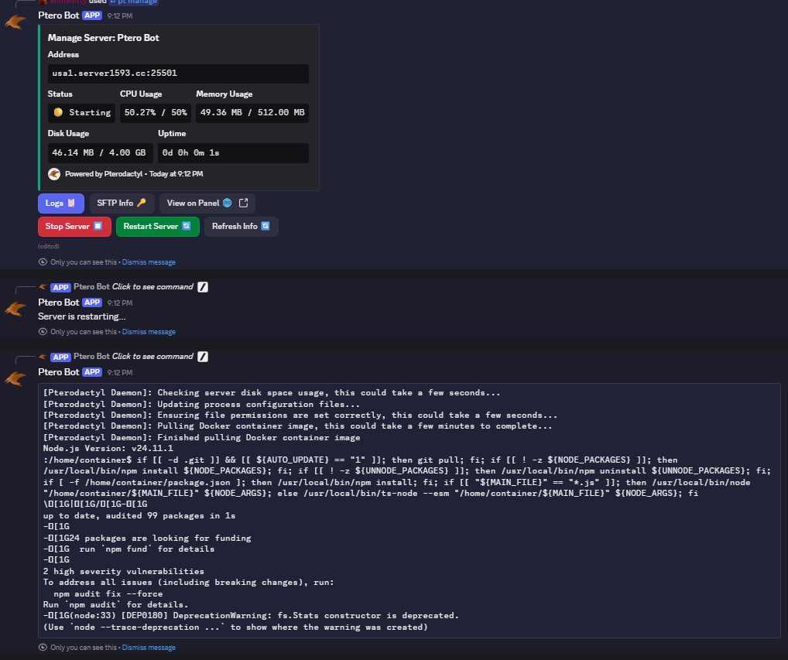
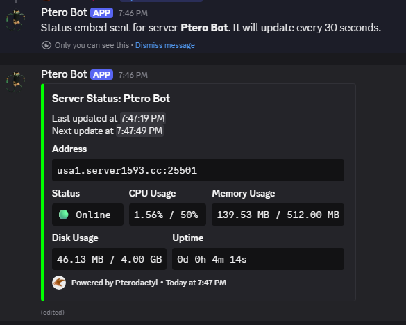
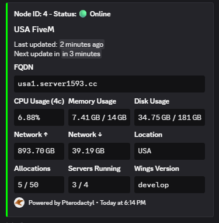

<h1 align="center">Welcome to Ptero-Bot 👋</h1>
<p align="center">    </p>

## A Discord bot built for managing, monitoring, and interacting with Pterodactyl servers — all directly from Discord.

🏠 Introduction

Ptero-Bot is a powerful, and simple Node.js Discord bot built for Pterodactyl panel users.

Using the Nodeactyl API, Ptero-Bot allows server owners and users to manage their Pterodactyl servers directly from Discord.

It provides real-time server monitoring, detailed embeds, and an interactive server manager UI inside Discord.

Even if you are not the owner of the Pterodactyl panel, you can still use user-specific API keys to manage your own servers through the bot. (Node status embeds will not work without an application API key. Server status will work fine)


## ✨ Core Features
### • Interactive Server Manager

The bot includes a basic server management interface using Discord buttons and embeds:

- Start / Stop / Restart server
- View live console logs
- View live resource usage (CPU, RAM, Disk)
- View server details (ID, Name, Status, Address, Uptime)
- View SFTP details (username, password, port)
- WebSocket-powered updates to avoid any rate limits
- Disable old sessions automatically when user starts a new one or after 60 seconds of inactivity
- Only one active session per user
- Any user with a linked API key can manage their own servers




### • Server Status Embeds

- Compact and detailed server info
- Power state icon and embed color
- CPU, RAM, storage, and uptime
- Api powered updates
- Only bot owners may create server status embeds to avoid spam





### • Node Status Embeds

- Resource usage (CPU, RAM, Disk)
- Power state icon and embed color
- Node name, location, allocations and FQDN
- Total servers hosted on the node
- Wings version
- Api powered updates
- Only bot owners may create node status embeds to avoid spam




## ✅ Extras

### • Autocomplete, Modals & Interaction-Ready

Full support for:

- Slash commands
- Autocomplete (server listings, IDs, etc.)
- Button interactions


### • Flexible API Key System

Supports:

- Global API key in config for non-user-specific actions (application api)
- User-specific API keys for personalized server management per user (client api)
- Synced user permissions with Pterodactyl panel


## ⚙️ Configuration


- Setup a Discord bot and get the bot token from the Discord Developer Portal: https://discord.com/developers/applications

- Rename config.example.json to config.json

- Fill in the required fields in config.json:
  ```
  token: Your Discord bot token
  owner: Your Discord user ID
  client_id: Your Discord bot's client ID
  test_guild_id: Your Discord server ID for testing slash commands
  pterodactyl:
     company: Your Pterodactyl panel's company name
     domain: Your Pterodactyl panel URL (e.g., https://panel.example.com)
     apiKey: Application API key for non-user-specific actions (not required)
     cl_apiKey: A user API key with admin privileges for fetching server usages on NODE status embeds (Only required if you also have an Application API key)
     API_ENCRYPTION_KEY: A secure random string for encrypting user API keys
  ```

- ▶️ Invite the Bot to Your Server
  - Use this URL, replacing CLIENT_ID with your bot's client ID:
  - ``` https://discord.com/oauth2/authorize?client_id=CLIENT_ID&scope=bot%20applications.commands&permissions=8 ```
  
- 🔧 Installation
  - ```npm install```

- ▶️ Run the Bot
  - ```npm start```

- 🔗 Link Api Key
  - Use the ```/pt key``` command to link your personal Pterodactyl API key to your Discord user account if you want to manage your own servers.

- ⚙️ Manage Your Servers
  - Use the ```/pt manage``` command to open the server manager for one of your linked servers!

- 📝 Create Status Embeds
  - Use the ```/pt {embed-type}-embed``` command to create server or node status embeds in your Discord server.
    - Only the bot owner can use this command to avoid spam or misuse.
    - Only one status embed per server or node is allowed to avoid spam.
    - Nodes require an application API key and a cl_apiKey with admin privileges set in the config.
    - Server status embeds only require a user-specific API key assigned with the ```/pt key``` command. This means you can create server status embeds for your servers even if you are not the owner of the pterodactyl panel.  


## 📋 Config Notes

- panelUrl must end with no trailing slash

- guildId is only required for local development slash-command registration but is also recommended for single-server bots to speed up command registration.

- cl_apiKey is required and used ONLY for getting server usages when updating status embeds since the application api does not have an endpoint for this. The user associated with this key must be an admin user to ensure all server usages can be fetched (unless you manually add the user to each server).

## 📚 Documentation

- Offical documentation is not yet available. Please refer to the source code and this readme for guidance.

## 👤 Author

- VolumeZero

## 🤝 Contributing

- PRs and suggestions are welcome!
- Issues can be opened any time.

## ⭐ Show Your Support

- If this bot helped you or you like it, please give it a star!

## 📝 License

- This project is licensed under the MIT License - see the LICENSE file for details.
